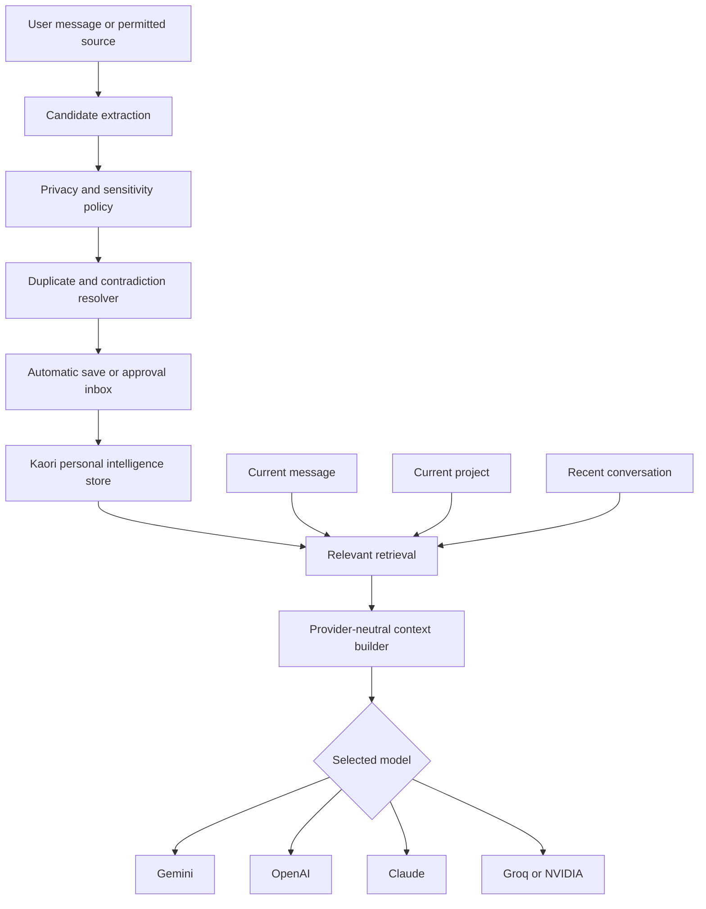

# Kaori Unified Personal Intelligence and Memory Plan

## 1. Purpose

Kaori's memory must become a provider-independent personal intelligence layer rather than a simple list of notes. Gemini, OpenAI, Claude, Groq, NVIDIA, and future providers should receive the same carefully selected Kaori-owned context.

The finished system should:

- Remember durable facts, preferences, people, relationships, goals, projects, events, routines, skills, and decisions.
- Separate global, project, session, and temporary context.
- Learn useful information without saving every conversation.
- Retrieve only relevant memories within a strict context budget.
- Detect duplicates, changes, and contradictions.
- Let users inspect, approve, edit, correct, export, or delete everything.
- Exclude secrets and sensitive information from automatic storage.
- Behave consistently across every model provider.

## 2. Current Project Baseline

Kaori already has:

- A `user_memories` table in Turso/libSQL.
- Authenticated memory create, list, update, and delete endpoints.
- Ownership checks for individual memory operations.
- A manual memory form and memory list.
- Project-linked conversations and project instructions.
- Injection of the 20 most recently updated memories into the chat system prompt.
- A shared chat pipeline for Gemini, Groq, NVIDIA, and DeepSeek.

Current limitations:

- Chat messages never create memories automatically.
- The explicit phrase "remember this" has no deterministic memory operation.
- Retrieval uses recency only, without relevance or project scoping.
- Memory is stored as unstructured text and tags.
- `source_conv_id` and `expires_at` are not fully used.
- The UI cannot edit memories even though a PATCH endpoint exists.
- There is no approval inbox, contradiction handling, or duplicate merging.
- There are no global, project, session, or temporary-chat controls.
- Memory content is not currently encrypted like conversation content.
- OpenAI and Claude provider adapters are not currently implemented.

## 3. Design Principles

1. **Kaori owns the intelligence.** Model providers reason over Kaori's context but never become the source of truth.
2. **User control is mandatory.** Every durable memory must remain visible, correctable, and removable.
3. **Do not remember everything.** Store durable value, not conversation transcripts disguised as memories.
4. **Retrieval quality matters more than memory quantity.** A small relevant set is better than a large noisy set.
5. **Project boundaries are strict.** Project context must never leak into another project or user account.
6. **Safe degradation is required.** Chat must continue working if extraction, embeddings, or retrieval enhancement fails.
7. **Automatic learning happens after response delivery.** Memory processing must not delay or break streaming chat.
8. **Every inference has provenance.** Kaori must record where a memory came from and whether the user confirmed it.

## 4. Target Architecture



## 5. Memory Data Model

Extend `user_memories` using backward-compatible migrations.

| Field | Purpose |
|---|---|
| `category` | Identity, preference, person, relationship, goal, project, event, routine, skill, decision, or fact |
| `scope` | Global, project, session, or temporary |
| `project_id` | Optional project boundary |
| `status` | Pending, approved, rejected, outdated, archived, or deleted |
| `source_type` | Manual, conversation, document, calendar, email, or system |
| `source_conv_id` | Conversation that produced the memory |
| `confidence` | Confidence that the extracted statement is accurate |
| `importance` | Expected future usefulness |
| `sensitivity` | Normal, personal, sensitive, or prohibited |
| `valid_from` | When the fact became valid |
| `expires_at` | When it should stop being retrieved |
| `last_confirmed_at` | Most recent user confirmation |
| `last_used_at` | Most recent retrieval use |
| `use_count` | Number of times used |
| `helpful_count` | Positive usage feedback |
| `unhelpful_count` | Negative usage feedback |
| `content_hash` | Fast exact-duplicate detection |
| `embedding` | Optional semantic-search representation |
| `metadata` | Versioned JSON for entities and provider-neutral details |

Add supporting tables:

- `memory_relations`: subject-predicate-object connections between memories and entities.
- `memory_events`: append-only audit history for creation, approval, edits, merges, usage, and deletion.
- `memory_settings`: global and per-project user controls.
- `memory_ignores`: memories ignored for a particular conversation or project.

All new columns require safe defaults so existing memories remain approved global memories.

## 6. Implementation Phases

### Phase 0 — Regression Baseline

- Add tests for validation, authentication, ownership, CRUD, prompt injection, and expiration.
- Record the expected behavior of current manual memory.
- Confirm that existing standalone and project chats remain unchanged.
- Keep the current production build passing.

**Exit criteria:** failures can be detected before the schema and retrieval behavior are changed.

### Phase 1 — Reliable Manual Memory

- Add memory editing to the workspace UI.
- Add `updateMemory` to the client API.
- Show actionable loading, save, edit, and deletion errors.
- Exclude expired, rejected, outdated, archived, and deleted records from retrieval.
- Encrypt memory content at rest.
- Migrate legacy plaintext records safely and idempotently.
- Centralize DTO conversion so GET, POST, and PATCH return identical fields.

**Exit criteria:** a memory can be created, refreshed, edited, recalled in a new chat, deleted, and verified absent.

### Phase 2 — Central Memory Service

Create a dedicated server-only module:

```text
src/app/api/lib/memory/
  types.ts
  service.ts
  repository.ts
  crypto.ts
  policy.ts
  dto.ts
```

Responsibilities:

- Encrypted CRUD and ownership enforcement.
- Scope and status filtering.
- Expiration checks.
- Content hashing and normalization.
- Audit-event creation.
- Safe DTO construction.
- Provider-independent interfaces.

Route handlers and the chat route must use this service instead of directly querying memory tables.

### Phase 3 — Explicit Memory Commands

Implement deterministic operations for:

- "Remember that..."
- "Forget..."
- "Update my..."
- "What do you remember about me?"
- "Do not use that in this chat."
- "Make this project-only."

Commands should create structured operations before ordinary response generation. Destructive or ambiguous commands require confirmation.

**Exit criteria:** direct memory instructions behave predictably and do not depend on a model choosing to follow prose.

### Phase 4 — Automatic Candidate Extraction

- Run extraction after a successful response is stored.
- Require strict structured output validated on the server.
- Extract only durable facts and relationships.
- Attach source conversation, category, confidence, importance, sensitivity, and entities.
- Never block the user-facing response if extraction fails.
- Deduplicate candidates before presenting or saving them.

Recommended policy:

- Explicit user requests: save immediately when safe.
- High-confidence, low-risk preferences: optionally auto-save when enabled.
- Inferred identity, relationships, goals, and events: request approval.
- Sensitive or prohibited information: never auto-save.

### Phase 5 — Approval Inbox

Add these memory views:

- Pending suggestions.
- Approved memories.
- Project memories.
- People and relationships.
- Goals and events.
- Outdated and archived memories.

Actions:

- Approve, reject, edit, merge, change scope, archive, or delete.
- Review the source conversation and extraction reason.
- Approve several compatible candidates together.
- Reject a category permanently through settings.

### Phase 6 — Reconciliation

Before saving a candidate:

1. Normalize the statement.
2. Compare its content hash.
3. Search semantically or lexically similar memories.
4. Determine whether it duplicates, enriches, or contradicts existing knowledge.
5. Ignore, merge, update, mark outdated, or request confirmation.

Never silently overwrite a user-confirmed memory with a lower-confidence inference.

### Phase 7 — Relevant Retrieval

Replace `getUserMemories(user.id).slice(0, 20)` with:

```ts
retrievePersonalContext({
  userId,
  projectId,
  conversationId,
  query,
  limit: 8,
  tokenBudget: 1800,
});
```

Initial deterministic score:

```text
semantic or lexical relevance
+ project relevance
+ category relevance
+ importance
+ confidence
+ recency
+ helpful-use history
- age decay
- contradiction risk
- sensitivity restrictions
```

Retrieval must:

- Prefer project memories inside that project.
- Allow relevant global memories unless project settings disable them.
- Exclude other projects.
- Respect conversation ignores and temporary-chat rules.
- Return deterministic limits and usage reasons.
- Work without embeddings through keyword and metadata matching.

### Phase 8 — Unified Personal Context Builder

Move prompt construction out of the main chat route.

```text
src/app/api/lib/personal-intelligence/
  context-builder.ts
  retrieval.ts
  extractor.ts
  reconciliation.ts
  policies.ts
  types.ts
```

The builder produces one compact provider-neutral context package containing:

- Relevant preferences.
- People and relationships.
- Active goals.
- Relevant events.
- Project instructions and decisions.
- Provenance identifiers and usage reasons.

The same context is supplied to every provider adapter.

### Phase 9 — Controls and Temporary Chats

Add settings for:

- Global memory on/off.
- Reading memories independently from writing memories.
- Automatic suggestions.
- Automatic saving of safe preferences.
- Per-project memory.
- Use of global memory inside a project.
- Disabled memory categories.
- Retention periods.
- Temporary chats.

Temporary chats must neither read nor write durable memory and must not generate conversation summaries.

### Phase 10 — Semantic Retrieval

- Add embeddings only after deterministic retrieval passes.
- Keep embeddings provider-independent when practical.
- Store the embedding model/version with each vector.
- Re-embed asynchronously when the model changes.
- Retain lexical and metadata fallback behavior.
- Never make ordinary chat availability depend on the embedding service.

### Phase 11 — Provider Expansion

Kaori currently needs dedicated OpenAI and Anthropic adapters before it can directly support all requested providers.

Add:

```text
src/app/api/lib/openai.ts
src/app/api/lib/anthropic.ts
```

Normalize:

- Streaming events.
- System context.
- Structured extraction.
- Tool calls.
- Token accounting.
- Spend limits.
- Retryable and terminal errors.

Memory behavior must remain identical when the response provider changes.

## 7. Additional Refinement Features

### Memory Consolidation

Periodically combine repetitive low-level memories into a concise higher-level memory while preserving the original audit history.

Example:

```text
Uses short headings + dislikes long introductions + requests direct answers
→ Prefers concise, structured responses.
```

### Confidence Decay and Reconfirmation

- Slowly reduce confidence for time-sensitive inferred memories.
- Never decay stable identity facts purely because of age.
- Ask for reconfirmation when an old fact becomes relevant again.
- Increase confidence when the user repeats or approves a fact.

### Conflict Timeline

Preserve changes instead of destroying history:

```text
2026-02: Preferred Java
2026-07: Began using TypeScript
2026-08: TypeScript became primary
```

Only the active valid fact should be retrieved by default.

### Correction Learning

If the user repeatedly rejects a kind of inferred memory, reduce or disable extraction for that category. If the user corrects a memory, use the correction to improve future candidate wording and confidence.

### Memory Health Dashboard

Show:

- Total active and pending memories.
- Memories never used.
- Frequently helpful memories.
- Contradictory or low-confidence memories.
- Expiring events.
- Storage and embedding usage.

### Context Budget Manager

- Reserve separate budgets for project instructions, recent conversation, memory, and tool results.
- Compress or omit low-value memories before truncating recent user context.
- Record which memories were omitted because of the budget.

### Why-Used Explanations

Attach provider-independent metadata to each response:

- Memory identifier.
- Human-readable reason.
- Source and scope.
- Relevance score.
- Ignore-once and stop-using actions.

### Event Lifecycle

- Automatically expire event memories after the event plus a grace period.
- Optionally transform completed events into durable summaries.
- Detect dates, time zones, recurrence, and rescheduling.

### Entity Aliases

Understand that "Kaori," "Kaori AI," and "my assistant project" may refer to the same entity. Alias changes should not create duplicate people or projects.

### Memory Summaries

Generate separate summaries for long conversations and projects. Summaries are contextual indexes, not automatically trusted durable facts.

### Import, Export, and Portability

- Export approved memories and relationships in JSON.
- Provide a readable Markdown export.
- Validate imports and require confirmation before merging.
- Support complete deletion with a clear audit-safe policy.

### Offline and Failure Fallback

When extraction or semantic search is unavailable:

- Chat continues normally.
- Explicit manual memory remains available.
- Retrieval falls back to scoped lexical ranking.
- Failed extraction jobs can be retried without duplicate creation.

## 8. Vision and Image Understanding Track

Image understanding currently shares the chat pipeline but has correctness and performance problems that must be fixed alongside personal intelligence.

### Current Findings

- The browser converts every image to a full base64 data URL before sending it.
- The same data URL is included twice as both `url` and `data`, although the server only needs `data`.
- Images are not resized, compressed, or stripped of unnecessary metadata.
- Kaori permits three files of up to 5 MB each, but applies no combined request-size limit.
- Base64 adds roughly one-third to the original binary size; duplicating it can turn three 5 MB images into a JSON body approaching 40 MB.
- The server must receive and parse the complete JSON body before SSE streaming begins.
- `supportsVision` exists only as UI metadata and is not enforced by the client or server.
- The default model is non-vision, but the upload control remains available.
- Kaori neither switches to a vision model nor clearly rejects an incompatible selection.
- Uploaded image content is attached only to the in-memory final message for the current request.
- The database stores only the accompanying user text, so follow-up questions lose the original image.
- The provider-neutral adapter sends images without an explicit detail/resolution policy.
- There are no vision-specific latency, provider-error, or answer-quality measurements.

### Vision Phase 1 — Correct Model Routing

- Define server-owned model capabilities rather than trusting client metadata.
- Reject images sent to non-vision models with an actionable error, or ask the user to switch.
- Offer an opt-in automatic switch to the preferred vision model.
- Display the selected vision model before sending.
- Validate actual provider support through a small capability/health test during deployment.
- Keep provider capability data in one shared server/client definition to prevent drift.

**Exit criteria:** an image can never be silently routed to a text-only model.

### Vision Phase 2 — Fast Client Preprocessing

- Remove the duplicate `url` field from the network payload; keep blob URLs only for local preview.
- Decode and resize images in the browser before upload.
- Preserve enough resolution for documents, screenshots, charts, and small text.
- Use orientation-aware processing and preserve transparency only when needed.
- Convert photographic images to a quality-controlled JPEG or WebP payload.
- Set separate presets:
  - `fast`: maximum dimension around 1280 px.
  - `balanced`: maximum dimension around 2048 px.
  - `document`: preserve higher detail and prefer lossless treatment where text requires it.
- Show the processed upload size before sending.
- Apply a combined payload limit in addition to the per-file limit.
- Perform preprocessing off the main UI path when practical to avoid input freezes.

**Exit criteria:** ordinary mobile photos produce substantially smaller requests without materially reducing recognition quality.

### Vision Phase 3 — Durable Attachment Storage

Do not store image base64 inside message rows. Add attachment metadata and object/blob storage:

```text
message_attachments
  id
  user_id
  conversation_id
  message_id
  storage_key
  mime_type
  width
  height
  byte_size
  sha256
  created_at
  expires_at
```

- Store files once and reference them by attachment ID.
- Verify ownership on every read.
- Generate a controlled signed or internal URL for providers that accept URLs.
- Retrieve recent relevant attachments for follow-up questions.
- Define project retention and deletion behavior.
- Deduplicate identical uploads through hashes without leaking data across users.

**Exit criteria:** follow-up prompts such as "look at the top-left corner again" retain the correct image context after refresh.

### Vision Phase 4 — Accuracy-Oriented Prompting

Build a vision task classifier before provider invocation:

- General scene understanding.
- OCR and document reading.
- Chart/table interpretation.
- UI or screenshot analysis.
- Object identification/counting.
- Spatial reasoning.
- Comparison of multiple images.

Generate a concise task-specific instruction:

- Ask the model to distinguish observed details from uncertain inference.
- Request transcription before interpretation for OCR-heavy images.
- Request axes, units, legends, and values before summarizing charts.
- Preserve image order and filenames for multi-image comparison.
- Ask for uncertainty when text or objects are not legible.
- Avoid inventing details when resolution is inadequate.

Add a user-visible `high detail` option for screenshots, documents, diagrams, and charts. The provider adapter should translate Kaori's neutral detail setting into the provider-specific request shape.

### Vision Phase 5 — OCR and Tool Routing

- Use a deterministic OCR path for text-heavy images instead of relying exclusively on a general multimodal model.
- Combine OCR text with the original image when layout or diagrams matter.
- Detect low OCR confidence and ask for a clearer image or crop.
- Use document/table extraction for dense tables.
- Use image crops/tiles for small regions instead of repeatedly uploading the entire original.
- Keep OCR and extracted text marked as untrusted user-provided content.

### Vision Phase 6 — Progressive Analysis

For large or complex images:

1. Send a fast, resized overview.
2. Determine whether more detail is necessary.
3. Crop or tile only relevant regions.
4. Run high-detail analysis on those regions.
5. Merge results with explicit uncertainty.

This reduces latency and cost while improving small-detail accuracy.

### Vision Phase 7 — Caching and Reuse

- Cache preprocessing output by image hash and preset.
- Cache safe OCR output and basic image metadata.
- Reuse attachment references for follow-up turns.
- Avoid resending unchanged image bytes when the provider supports uploaded-file references.
- Invalidate derived data when processing versions change.

### Vision Phase 8 — Evaluation and Observability

Create a small representative evaluation set containing:

- Mobile photos in good and poor lighting.
- Screenshots with small text.
- Receipts and documents.
- Charts with legends and units.
- Tables.
- UI bug screenshots.
- Multiple-image comparisons.
- Rotated and unusually large images.

Measure:

- Client preprocessing time.
- Request payload bytes.
- Time until server response headers.
- Provider time to first token.
- Total response time.
- OCR character accuracy.
- Chart/value accuracy.
- Unsupported-model and provider failure rates.
- Accuracy before and after resizing for each preset.

### Vision Delivery Order

| Sprint | Deliverable |
|---|---|
| V1 | Capability enforcement, clear model switching, and actionable errors |
| V2 | Remove duplicated data, client resizing/compression, and total payload limits |
| V3 | Durable attachment storage and follow-up image context |
| V4 | Task classifier, detail policy, OCR routing, and progressive crops |
| V5 | Evaluation dataset, latency metrics, provider comparison, and tuning |

### Vision Definition of Done

- Text-only models never receive image requests silently.
- Normal photos are resized and sent only once.
- The UI remains responsive during preprocessing.
- Follow-up questions retain attachment context after refresh.
- OCR, chart, screenshot, and general-image tasks receive appropriate processing.
- Kaori reports uncertainty rather than fabricating unreadable details.
- Vision failures do not corrupt or block ordinary chat.
- Latency and accuracy regressions are caught by repeatable evaluations.

## 9. Security and Privacy Requirements

- Never automatically store passwords, authentication tokens, API keys, recovery codes, or private cryptographic material.
- Treat medical, financial, precise-location, legal, and intimate information as sensitive and approval-only.
- Encrypt durable memory content at rest.
- Scope every database operation to the authenticated user.
- Verify project ownership before reading or writing project memory.
- Do not log plaintext memory content.
- Apply size, count, and rate limits to extraction and memory APIs.
- Defend the extraction pipeline from prompt injection inside files and tool results.
- Keep memory context clearly separated from system instructions.
- Provide complete deletion, retention, and export controls.

## 10. Test Strategy

### Unit Tests

- Validation and normalization.
- Encryption and legacy plaintext migration.
- Scope/status/expiration filtering.
- Duplicate hashes and similarity thresholds.
- Contradiction policy.
- Retrieval scoring and deterministic limits.
- Sensitive-information classification.

### API Tests

- Authenticated CRUD.
- Cross-user isolation.
- Project ownership.
- Approval and rejection.
- Remember, update, forget, and recall commands.
- Temporary-chat behavior.
- Safe retry and idempotency.

### End-to-End Scenarios

1. Save a manual preference and recall it in a new chat.
2. Edit it and ensure the old content is no longer retrieved.
3. Say "remember this" and verify structured persistence.
4. Approve and reject automatic candidates.
5. Introduce a contradiction and resolve it safely.
6. Verify project memory cannot appear in another project.
7. Delete a memory and verify that no provider receives it.
8. Confirm temporary chats read and write no durable memory.
9. Switch response providers and verify equivalent personal context.
10. Disable embeddings and confirm lexical fallback still works.

## 11. Rollout Plan

Use feature flags:

- `memory_v2_schema`
- `memory_explicit_commands`
- `memory_suggestions`
- `memory_relevance_retrieval`
- `memory_semantic_retrieval`
- `memory_relationships`

Rollout sequence:

1. Migrate schema without changing retrieval.
2. Enable the centralized service and manual-memory improvements.
3. Enable explicit commands.
4. Enable suggestions for internal/test accounts.
5. Enable deterministic relevance retrieval.
6. Add embeddings and relationship intelligence gradually.
7. Enable automatic saving only after false-positive rates are acceptable.

Each flag must be reversible without deleting or corrupting existing memory.

## 12. Delivery Order

| Sprint | Deliverable |
|---|---|
| 1 | Regression tests, editing, expiration, errors, and encrypted storage |
| 2 | Structured schema, migrations, and centralized memory service |
| 3 | Explicit remember/update/forget/recall commands |
| 4 | Automatic extraction, privacy policy, and approval inbox |
| 5 | Duplicate, contradiction, and outdated-memory reconciliation |
| 6 | Scoped relevance retrieval and context budgets |
| 7 | Relationships, goals, events, and unified context builder |
| 8 | Temporary chats, settings, explainability, import, and export |
| 9 | Optional semantic retrieval and memory consolidation |
| 10 | OpenAI/Claude adapters and complete provider regression testing |

## 13. Definition of Done

The memory feature is considered production-ready when:

- Manual and explicit memories persist reliably across conversations.
- Automatic candidates are useful, safe, and user-controlled.
- Irrelevant, expired, rejected, and cross-project memories are never injected.
- Duplicate and conflicting facts are resolved without silent data loss.
- Users can understand and control why each memory was used.
- Temporary chats leave no durable memory trace.
- Memory content is encrypted and never exposed in logs.
- Retrieval remains available when embeddings or extraction providers fail.
- Every supported model receives equivalent Kaori-owned personal context.
- Cross-user isolation, build, test, and end-to-end suites pass.

The governing product principle is:

> Models provide reasoning. Kaori owns memory, identity, relationships, permissions, provenance, and personal intelligence.
